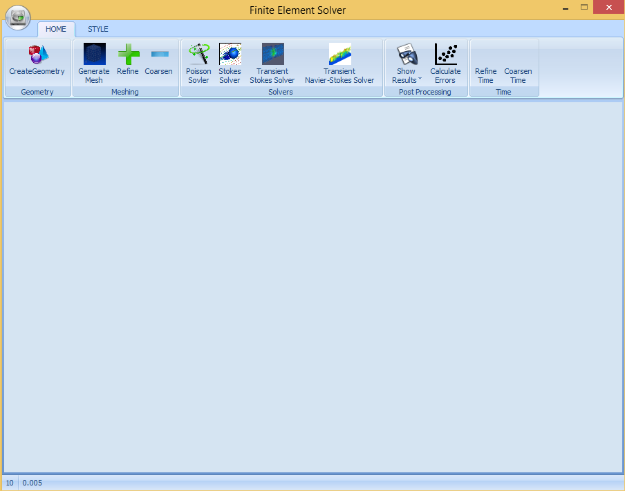
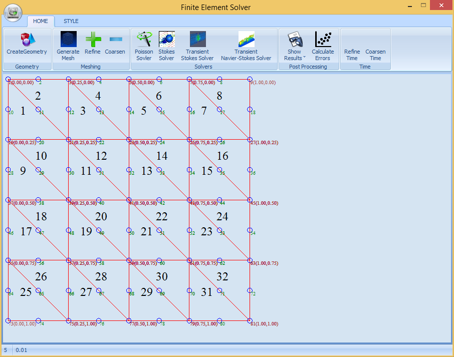

# Introduction
FEMPDE is a software for solving partial differential equations using finite element method. The software comes with a user friendly GUI to facilitate processing and post-processing stages.
The source code is available free uder the GPL license. 

# Capabilities
A brief capabilities of the software is as follows:

* Automatic Grid Generation
* Adaptive Time step regulation
* Solves Poisson equation 
* Solves Time dependent Naiver-Stokes equations
* Plotting numerical resutls 
* Export Grid to  EPS file format
* Export Results to CSV, and TXT file formats

# Requirements

-  .Net Framework 
-  [Janus Systems](http://www.janusys.com)
-  [Math.NET Numerics](https://numerics.mathdotnet.com)
-  [OxyPlot](http://www.oxyplot.org)
#User Manual
You can find a detailed manual of the code [here](UserManual.pdf).
